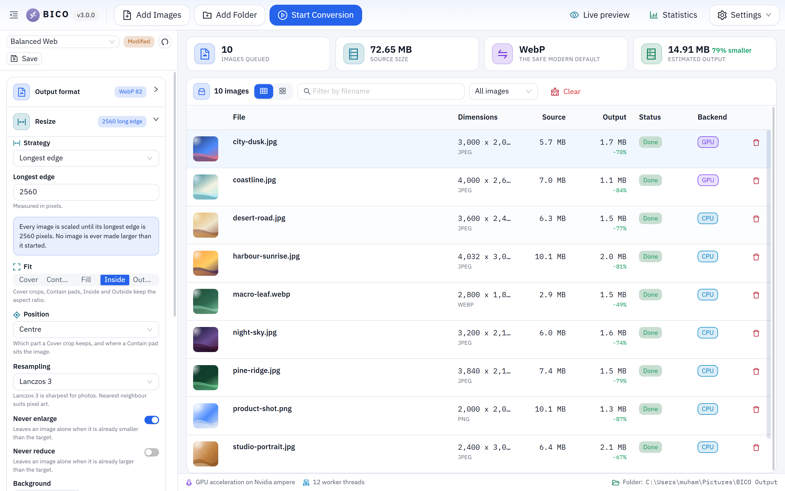
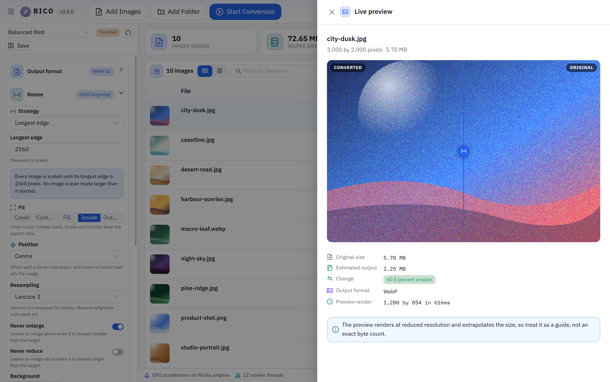
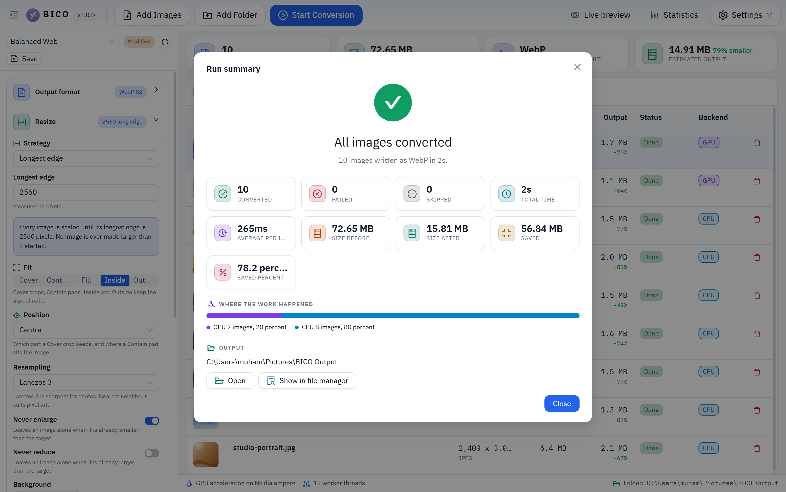
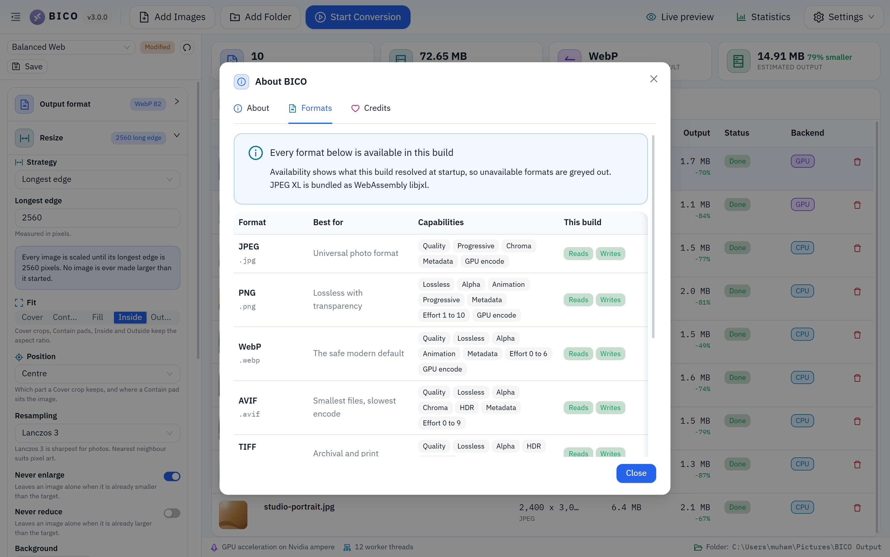

<div align="center">


# BICO

**Bulk Image Converter and Optimizer**

A professional grade desktop tool for converting, compressing and optimising images in bulk.
Nine output formats, a multi threaded native pipeline, optional GPU acceleration, and a live
before and after preview so you know what you are getting before you commit.

[](LICENSE)
[](CHANGELOG.md)
[](https://electronjs.org)
[](#installation)

</div>

---

## What it is

BICO takes a folder of images and turns it into exactly the images you need: smaller, in a
different format, resized, cleaned of metadata, watermarked, or all of those at once. It runs
entirely on your machine. Nothing is uploaded anywhere.

It is built for the case where you have five thousand photos, not five.

## Highlights in 3.0.0

| | |
|---|---|
| **Never blocks** | Encoding runs in a pool of native worker threads sized to your CPU. The interface stays at full frame rate through a fifty thousand file run. |
| **GPU accelerated** | Resize, filters and colour work run as WebGPU compute shaders. On an NVIDIA card that executes on the CUDA cores. Detection and fallback are automatic. |
| **Multi GPU aware** | Machines with a discrete and an integrated adapter can drive both at once, each on its own lane. |
| **Nine formats** | JPEG, PNG, WebP, AVIF, TIFF, GIF, HEIF, JPEG XL and JPEG 2000, each with its real encoder controls rather than a single quality slider. The last two ship with the app, so they work on every platform. |
| **Speaks three languages** | English, Turkish and Arabic, with the whole interface flipping to right to left for Arabic. Every string is translated, including the explanatory copy under each control. |
| **Eight themes** | Complete palettes rather than an accent swap, each previewed live before you pick it, plus light, dark or follow the system. |
| **Keeps score** | A lifetime tally of everything converted, with a ninety day activity chart, a per format breakdown and the GPU versus CPU split. |
| **Live preview** | Side by side wipe comparison at your current settings, with the projected output size, before you run anything. |
| **Size targeting** | Give it a byte budget and it searches the quality scale per image until each file fits. |
| **Variant output** | One source in, a full responsive set out. Generate 480w, 960w and 1440w renditions plus a JPEG fallback in a single pass. |
| **Hot folder** | Point it at a directory and anything dropped in is converted automatically, with a tray icon so it keeps working after you close the window. |
| **Honest numbers** | Per file timings, throughput, GPU versus CPU split, and an optional CSV audit of every conversion. |
| **Tells you what it found** | A welcome screen on first run naming your processor, worker count and graphics adapter, so you know the hardware was picked up without going looking for it. |

## Screenshots

<div align="center">
  
  <p><em>The queue, with per file status, backend and size delta</em></p>
</div>

<div align="center">
  
  <p><em>Live preview, wiping between the original and the result at the current settings</em></p>
</div>

<div align="center">
  
  <p><em>The summary, including how the work split between GPU and CPU</em></p>
</div>

<div align="center">
  
  <p><em>What the copy of libvips on your machine can actually read and write</em></p>
</div>

## Installation

Download the installer for your platform from the
[releases page](https://github.com/shehari007/BICO-bulk-image-converter-optimizer-tool/releases).

| Platform | File | Notes |
|---|---|---|
| Windows | `BICO-3.0.0-x64-setup.exe` | Also available for arm64. Choose your install directory during setup. |
| macOS | `BICO-3.0.0-arm64.dmg` | Universal builds are produced for Apple silicon and Intel separately. |
| Linux | `BICO-3.0.0-x86_64.AppImage` | `.deb` and `.rpm` packages are published alongside it. |

The app checks for updates on launch and can install them in place on Windows and Linux. You can
turn the check off under Diagnostics, Preferences.

On macOS, updates are downloaded by hand. BICO tells you when a new version is available and opens
the releases page so you can fetch the disk image.

## Formats

| Format | Best for | Alpha | Animation | Notes |
|---|---|:--:|:--:|---|
| **WebP** | The default answer for the web | yes | yes | Around 30 percent smaller than JPEG at matching quality, supported everywhere. |
| **AVIF** | Smallest possible files | yes | no | Often half the size of WebP. Encoding is CPU heavy, raise the effort slider only when it matters. |
| **JPEG XL** | Archives and pipelines | yes | no | Smaller than AVIF and faster to encode. Browser support is still limited. |
| **JPEG 2000** | Medical, cinema, geospatial | yes | no | The format those pipelines require. Supplied by the app, not by libvips. |
| **JPEG** | Photos that must open anywhere | no | no | MozJPEG encoding, trellis quantisation and progressive scans are all exposed. |
| **PNG** | Screenshots, logos, UI assets | yes | yes | Palette mode with dithering cuts flat artwork by more than half. |
| **TIFF** | Print and archival | yes | no | LZW, Deflate, PackBits, ZSTD and JPEG compression, plus pyramidal tiling. |
| **HEIF** | Apple ecosystem | yes | no | Written through the same AV1 codec as AVIF. |
| **GIF** | Legacy animation | yes | yes | 256 colour palette. Prefer animated WebP where you can. |

Reading is broader than writing: BMP, ICO and SVG come in as well.

### How JPEG XL is provided

No prebuilt `sharp` binary includes libjxl, so libvips cannot read or write JPEG XL on any
platform. Rather than ask you to build a custom libvips, BICO bundles its own WebAssembly build of
libjxl. It costs about 2 MB, behaves identically on Windows, macOS and Linux, and needs no native
toolchain from anyone who clones the repository.

It earns its place. Measured on a 1920 by 1080 photograph:

| Encoder | Output | Encode time |
|---|---|---|
| JPEG XL quality 75, effort 4 | **304 KB** | **510 ms** |
| AVIF quality 60, effort 4 | 387 KB | 1422 ms |
| JPEG quality 82, MozJPEG | 410 KB | 362 ms |
| WebP quality 82 | 662 KB | 331 ms |

Two honest limitations, both stated in the app itself: the bundled encoder writes pixels only, so
metadata is not carried into a JPEG XL output, and it handles a single frame, so animation is not
supported for that format.

### JPEG 2000, and why not a custom libvips

The same problem applies twice over: no prebuilt `sharp` binary carries OpenJPEG either. The
tempting fix is to build a custom libvips, and it is the wrong one. It would mean owning six
platform and architecture builds, rebuilding all of them on every `sharp` release, and breaking
`npm install` for anyone on Windows, where linking a global libvips is unsupported by design.

So JPEG 2000 is provided the same way JPEG XL is, by a WebAssembly build that ships with the app.
It uses ImageMagick with OpenJPEG, writes a real JP2 container, and reads one back. One caveat found
by measurement rather than assumption: the `jp2:rate` define does nothing, `quality` is the lever
that works, and its curve is steep, so the slider is mapped to match.

Like JPEG XL, this encoder takes pixels only, so metadata is not carried into a JPEG 2000 output.

Whatever your machine actually resolved is reported under **About, Formats**, and the format picker
greys out anything unavailable rather than letting you start a run that would fail on every file.

## Languages

The interface is fully translated into **English, Turkish and Arabic**, including the explanatory
copy under every control, which is the bulk of the words and the part that makes the tool usable.

Arabic switches the whole layout to right to left. That is a real mirror of the interface rather
than a mirrored font: panels, tables, sliders and drawers all change side.

Translations are typed against the English key set, so a string added in a future release fails to
compile until every language supplies it. Nothing can silently fall back to English without someone
noticing, and if one ever does at runtime it degrades to a readable English sentence rather than a
raw key.

Pick a language under **Diagnostics, Preferences**.

## Themes

Eight complete palettes, not accent swaps: Midnight, Graphite, Nord, Dracula, Forest, Daylight,
Paper and High Contrast. Each is previewed as a live miniature of the interface before you pick it.

Two settings work together here, which is worth stating plainly because it confuses people:

- **Light, dark or follow the system** decides the base.
- **The theme** decides the palette used within that base.

So choosing Nord does not stop the app following your system setting. If the base flips to light,
BICO falls back to the nearest light palette. The accent colour is adjustable on top of any theme,
with a reset back to that theme's own suggestion.

## Typography

BICO ships its own typeface rather than borrowing the system UI font, so the interface reads the
same on Windows, macOS and Linux instead of looking like a different product on each.

The family is **IBM Plex**, under the SIL Open Font License. It was chosen for one reason above the
others: its Arabic is a designed companion to the Latin, not a substitute face pulled in from
somewhere else. Switching the interface to Arabic keeps the same voice, weight and rhythm rather
than visibly changing typeface halfway through the product. Its Latin Extended coverage also draws
the Turkish dotted and dotless i, the breve and the cedilla properly.

The font files are bundled with the build. Nothing is fetched at runtime, which is a requirement
rather than a preference: the app runs behind a content security policy that blocks every external
host, and it has to work offline.

Numbers are set with tabular figures anywhere they sit in a column, so the queue, the statistics
tiles and the status bar stop shifting sideways as values update mid run.

## First run

The first launch opens a welcome screen, and it returns exactly once after an upgrade, because
that is the only moment it has anything new to say. It carries the release notes for the version
you just installed and, more usefully, the hardware BICO actually found: your processor and thread
count, how many worker threads it started, and the graphics adapter it will use, or a plain
statement that it found none and will run on the CPU.

That last part exists because the alternative is silence. A converter that quietly ignores a
discrete GPU looks exactly like one that never supported it, and most people never open a
diagnostics panel to find out which they have.

There is a **do not show again** checkbox, ticked by default. It records the version rather than a
flag, so dismissing it now still lets the next release introduce itself.

## Statistics

BICO keeps a local lifetime tally, stored on your machine and sent nowhere. It records total images
converted, total space saved, time spent, a ninety day activity chart, a per format breakdown, the
GPU versus CPU split and your best single run.

Failed images deliberately do not count towards the byte figures. Counting a failure as zero bytes
out would report it as a hundred percent saving, which is exactly the flattering nonsense the panel
exists to avoid.

## GPU acceleration

Image codecs are CPU bound by nature, so BICO does not pretend the GPU can do everything. What it
does is move the parts that genuinely parallelise onto it.

```
                 decode          resize + filters        encode
                   |                    |                   |
  GPU route     Chromium            WebGPU compute      Chromium
  (full)        threaded            shaders             canvas encoder
                decoder             on the adapter      (jpeg, png, webp)

  GPU route     Chromium            WebGPU compute      libvips
  (assist)      threaded            shaders             (avif, tiff, jxl, heif)
                decoder             on the adapter

  CPU route     libvips             libvips             libvips
```

The scheduler picks per image and falls back silently. If a shader fails, a device is lost, or a
driver resets, that image simply reruns on the CPU pool and the fallback is counted in the
diagnostics panel. **The app works identically with no GPU at all.**

On NVIDIA hardware the compute shaders execute on the CUDA cores through the Vulkan or Direct3D 12
backend. No CUDA toolkit is needed, and AMD, Intel and Apple GPUs are supported by exactly the
same code path.

Adapter detection, the active lanes and the Chromium graphics report are all visible under
**Diagnostics, Graphics**.

## Filename templates

The output name is a template. These tokens are available:

| Token | Expands to |
|---|---|
| `{name}` | Original filename without its extension |
| `{format}` | Output format id, for example `webp` |
| `{index}` `{total}` | Position in the queue, zero padded, and the queue size |
| `{width}` `{height}` | Output dimensions in pixels |
| `{quality}` | Quality value used for this file |
| `{preset}` | Name of the active preset |
| `{variant}` | Suffix of the current size variant |
| `{parent}` | Name of the folder the source came from |
| `{date}` `{time}` | Run date as `YYYYMMDD` and time as `HHMMSS` |
| `{random}` | Six random characters |

So `{name}-{width}w` over a folder of photos gives you `beach-1440w.webp`, `beach-960w.webp` and
so on, ready to drop into a `srcset`.

## Presets

Fifteen presets ship with the app, including Balanced Web, Maximum Compression, Photography JPEG,
Responsive Image Set, Square Thumbnails, Email Size Budget, Print Archive, Palette Flat Artwork,
Document Scan Cleanup and JPEG XL Archive.

Any settings you build can be saved as your own preset, and presets export to a JSON file you can
share or check into a repository alongside a project.

## Keyboard

| Shortcut | Action |
|---|---|
| `Ctrl/Cmd + K` | Command palette |
| `Ctrl/Cmd + O` | Add images |
| `Ctrl/Cmd + Shift + O` | Add a folder |
| `Ctrl/Cmd + D` | Choose the output folder |
| `Ctrl/Cmd + Return` | Start the conversion |
| `Ctrl/Cmd + P` | Pause or resume |
| `Ctrl/Cmd + L` | Toggle the live preview |
| `Ctrl/Cmd + B` | Toggle the sidebar |
| `Escape` | Close the open panel, or cancel a run |
| `Delete` | Remove the selected file from the queue |

## Building from source

**Requirements:** Node 20.19 or newer, and the standard native build toolchain for your platform
(Visual Studio Build Tools on Windows, Xcode command line tools on macOS, `build-essential` on
Linux). `sharp` ships prebuilt binaries for common platforms, so most people never need to compile
anything.

```bash
git clone https://github.com/shehari007/BICO-bulk-image-converter-optimizer-tool.git
cd BICO-bulk-image-converter-optimizer-tool
npm install
```

| Command | What it does |
|---|---|
| `npm run dev` | Start with hot reload for the renderer and automatic restarts for the main process |
| `npm run typecheck` | Type check the Node side and the web side separately |
| `npm run lint` | ESLint across the whole tree |
| `npm run format` | Prettier |
| `npm run build` | Type check, then produce the production bundle in `out/` |
| `npm run build:win` | Build and package NSIS installers for x64 and arm64 |
| `npm run build:mac` | Build and package a DMG |
| `npm run build:linux` | Build and package AppImage, deb and rpm |

Installers land in `dist/`.

## Architecture

Four processes, one typed contract.

```
  src/shared/          types.ts is the single source of truth. Every process
                       compiles against it, so a renamed field is a build error
                       rather than a runtime surprise.

  src/main/            Electron main. Owns the window, the job scheduler, the
    services/pool      worker thread pool, the ZIP writer and the file registry.
    workers/           The sharp pipeline, one instance per worker thread.

  src/preload/         The only bridge. contextIsolation is on, nodeIntegration
                       is off, so window.bico is the complete list of privileged
                       operations the interface can perform.

  src/renderer/        React 19 and Ant Design 6.
    gpu/               WebGPU lanes, one Web Worker per adapter.
```

A few decisions worth knowing about:

- **Renderer files are read through a custom `bico-src` scheme, not a path.** The URL carries an
  opaque id that is looked up in the import registry, so the renderer cannot request a file the
  user did not add to the queue. There is no path traversal surface.
- **The ZIP is streamed.** Entries are appended as each image finishes, so peak memory is one
  image rather than the whole run.
- **Cancellation is cooperative.** Work already inside a worker finishes so nothing is left half
  written, but no new file is claimed.
- **Quality search decodes once.** Targeting a byte budget re encodes from a decoded raw buffer
  rather than reopening the source per iteration.

There is more detail in [docs/ARCHITECTURE.md](docs/ARCHITECTURE.md).

## Upgrading from 2.x

3.0.0 is a full rewrite. The interface, the settings model and the build system all changed.

**On Windows the installer removes 2.x for you.** Run it and you end up with one BICO, one Start
Menu entry and one program folder, as you would expect. This is worth stating because it very
nearly did not work: the application id changed in this release, Windows keys its uninstall entry
on an id derived from it, and the first build of 3.0.0 would have installed a second copy
alongside the old one with neither aware of the other. The installer now keeps the identity the
2.x releases registered under, so the ordinary upgrade path finds the old version and uninstalls
it before this one is written. If you had moved the old install to another drive, the new one is
placed in the same location under the current name.

Your 2.x files and settings are left alone by that uninstall. Nothing you converted is touched.

On macOS and Linux the old and new builds carry different names, so if you installed 2.x there,
remove it by hand: drag the old **BICO-Bulk Image Converter Tool** out of Applications, or
`apt remove` the old package.

- Your 2.x settings are not migrated. The preset system replaces them and covers the same ground.
- Output is written by a background thread now, so ZIP archives no longer pass through the
  browser download mechanism. You choose the archive path up front.
- The Node integration that 2.x exposed to the page is gone. This is the single most important
  change in the release.

See [CHANGELOG.md](CHANGELOG.md) for the full list.

## Contributing

Issues and pull requests are welcome. [CONTRIBUTING.md](CONTRIBUTING.md) covers the layout, the
coding conventions and how to run the app locally.

## Licence

[MIT](LICENSE)

## Author

**Muhammad Sheharyar Butt**
[GitHub](https://github.com/shehari007) | shehariyar@gmail.com

If BICO saved you some time, a star is appreciated, and there is a
[coffee link](https://www.buymeacoffee.com/shehari007) if you are feeling generous.
